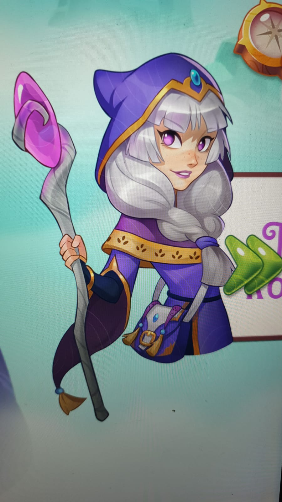

# Game Design Document
## Die Midgard-Saga -Niflheim-

### Status 13.05.2020

## Beteiligte (alphabetisch):

- Alexandra Bauer - Autorin
- Julia Senf - Grafik/Design
- Christian Strauss - Sound-FX
- Dominic Gerweck - Entwicklung/Code
- Thomas Fischer - Grafik/Design/Entwicklung

## Ziel:

- Entwicklung eines 2D RPG für mobile Endgeräte.
- Viel Spass haben.
- ...
- ...
- Alle Projektbeteiligte sind am Ende **Quellensituationaere!**

## Basis:
Inline-style: 

Reference-style: 
![alt text][logo]

[logo]: source/images/515y-Z5Ue3L.jpg "Logo Title Text 2"

**"Die Midgard-Saga -Niflheim-" von Alexandra Bauer**

Als Thea eines Tages von einem rotbärtigen Mann verfolgt wird, ahnt sie nicht, dass dies der Beginn von etwas Großem ist. Nach Asgard entführt, dem Wohnsitz der nordischen Götter, bekommt sie von Odin einen Auftrag: Sie soll Kyndill finden, ein Zauberschwert, das in den Händen des Feuergottes Loki die Macht besitzt, alle Götter zu töten. Zusammen mit ihrer Freundin Juli und begleitet von Thor und Wal-Freya, begibt sich Thea nach Niflheim, einer eisigen Welt im tiefen Norden. Hier ging das Schwert einst verloren. Aber auch Loki sucht nach der Waffe. Wie eine düstere Bedrohung lauert er hinter jeder ihrer Handlungen...

Thea glaubt ein normaler Teenager zu sein. Doch die Begegnung mit der nordischen Göttin Wal-Freya stellt ihr Leben auf den Kopf. Sie offenbart Thea eine Vergangenheit, die sie schon vor Jahrhunderten unwiderruflich mit dem Schicksal der Götter verknüpfte. Plötzlich ist es an Thea, eine alte Gefahr von den nordischen Göttern abzuwenden. Ihre beste Freundin Juli begleitet sie. Doch die beiden ahnen nicht, dass sich der Feuergott Loki bereits an ihre Fersen geheftet hat. Wie eine dunkle Bedrohung lauert er hinter jeder ihrer Handlungen 

Get the book @ Amazon right [here](https://www.amazon.de/Die-Midgard-Saga-Niflheim-Alexandra-Bauer/dp/1501033824 "get the book!")

## Design Gameplay:
- Basis fuer das Design

## Character/Player:
- Thea (Hauptfigur)

       

 
 

- Wal-Freya (Begleiterin)

- Loki (Gegnerischer Charakter - Endboss)

- Odin (.....)

- Juli (Nebencharakter)
- Thor (Begleiter)
- rotbärtiger Mann und Sonstige

        
   

   
      

   
      

   
      

         
         

## Inventar und Gegenstaende:
- Kyndill (Zauberschwert)
- ...
- ...
- ...
- ...

## Levels:

- Level 01

- ...
- ...
- ...
- ...

## Sounds:
- ...
- ...
- ...
- ...
- ...

## Goals:
- Finde das Zauberschwert Kyndill !
- Besiege Loki !
- ...
- ...
- ...

## Anmerkungen / Ideen / ...
- ...
- ...
- ...
- ...
